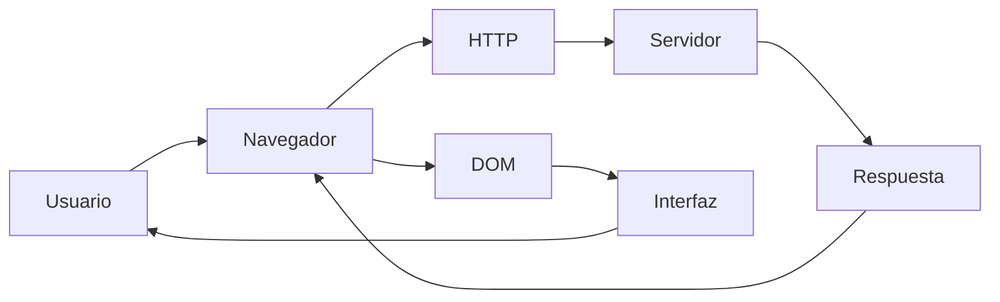
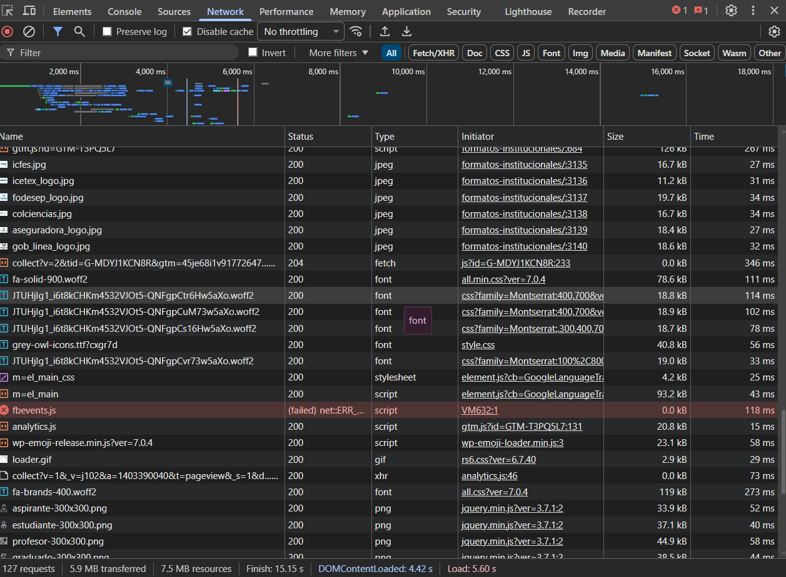
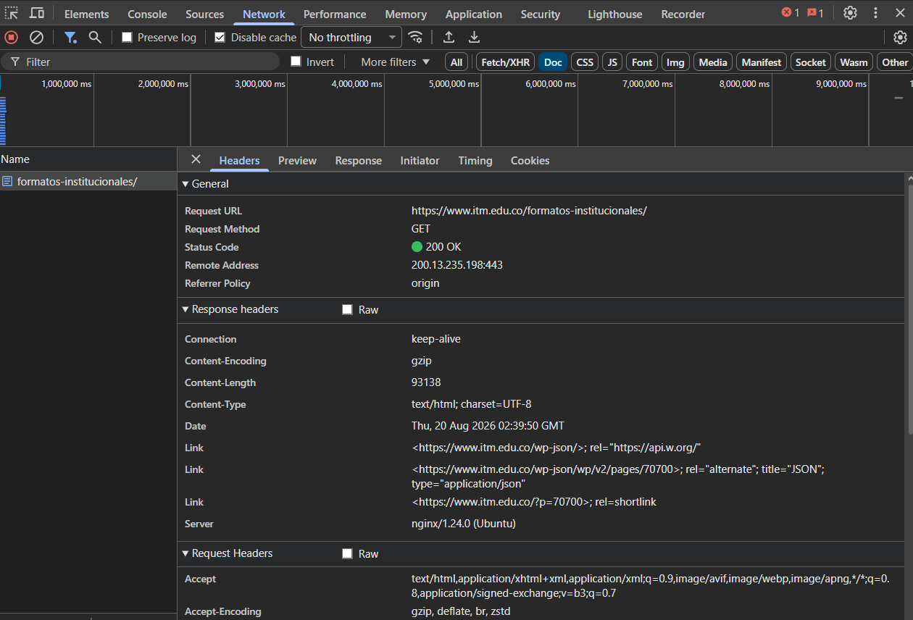
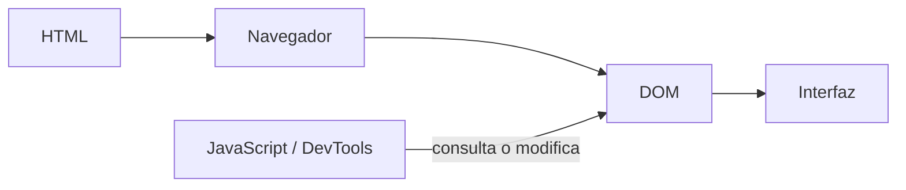
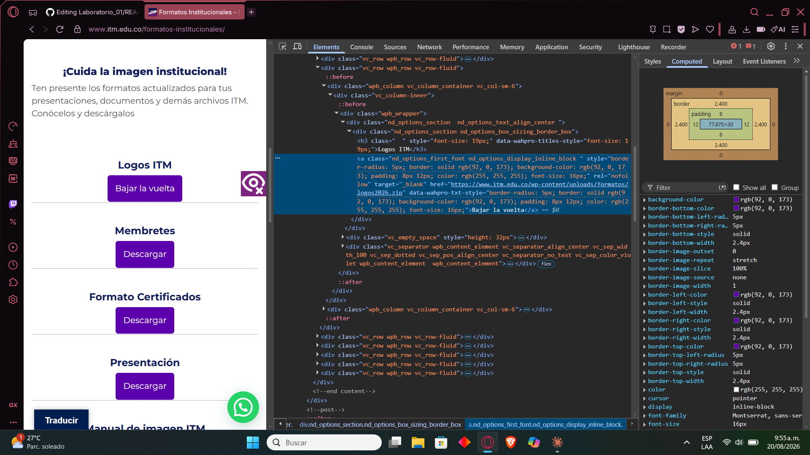
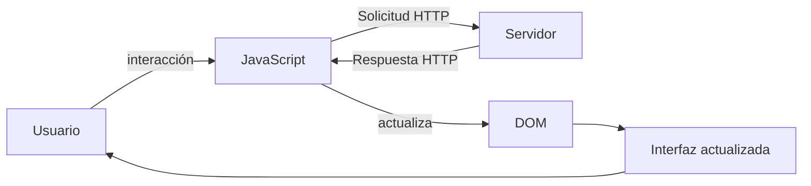
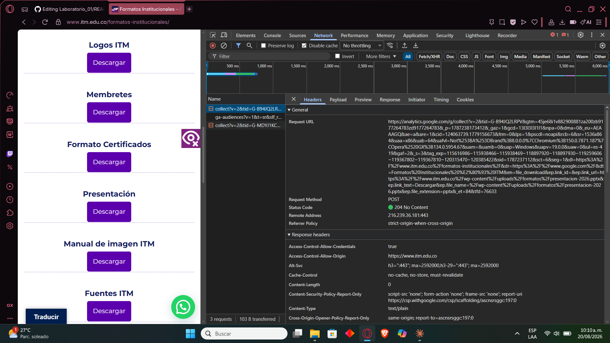

# Laboratorio_01
Análisis del funcionamiento de una aplicación web 

# Laboratorio 01 --- Análisis del funcionamiento de una aplicación web

> **Curso:** Aplicaciones y Servicios Web\
> **Modalidad:** Práctica de laboratorio\
> **Entrega:** Repositorio GitHub --- archivo `README.md`\
> **Evidencias:** Carpeta `evidencias/`

------------------------------------------------------------------------

## Objetivo de la práctica

Analizar el funcionamiento de una aplicación web real mediante las
herramientas de desarrollo del navegador, identificando los recursos
cargados, las solicitudes y respuestas HTTP, la estructura DOM y las
interacciones entre cliente y servidor.

## Resultado esperado

Al finalizar la práctica, el estudiante deberá poder reconstruir y
documentar el flujo observado entre:



> El diagrama anterior representa los **componentes que serán
> analizados**. El diagrama final de la práctica deberá ser construido
> por el estudiante a partir de sus propias observaciones.

------------------------------------------------------------------------

# 1. Preparación del entorno

1.  Ingrese a la aplicación web indicada por el docente.
2.  Abra las **herramientas de desarrollo** del navegador.
3.  Identifique las herramientas **Red / Network** y **Elementos /
    Elements**.
4.  Cree la siguiente estructura dentro del repositorio:

``` text
laboratorio-01/
├── README.md
└── evidencias/
```

El archivo `README.md` será el informe de la práctica. La carpeta
`evidencias/` contendrá las capturas utilizadas para sustentar los
resultados.

------------------------------------------------------------------------

# 2. Identificación de recursos de la aplicación

Abra la herramienta **Red / Network** y recargue completamente la
aplicación.

Observe las solicitudes generadas durante la carga e identifique como
mínimo **cinco recursos**, procurando seleccionar tipos diferentes:
documento HTML, CSS, JavaScript, imágenes, fuentes u otros.

## Resultados

Complete la tabla:

  | Recurso                   | Tipo           | Dominio     | Tamaño
  --------- ------ --------- --------
  | formatos-institucionales/ | HTML           | itm.edu.co  | 125 KB |
  | m-el_main_css             | CSS            | itm.edu.co  | 4.2 KB |
  | m-el_main                 | JavaScript     | itm.edu.co  | 93.2 KB |
  | icfes.jpg                 | Imagen (JPEG)  | itm.edu.co  | 16.7 KB |
  | fa-solid-900.woff2        | Fuente (WOFF2) | all.min.css | 78.6 KB |                           
                             
                             
                             
                             

**Total de solicitudes observadas:** `_127_`

## Evidencia

Guarde una captura de la pestaña Network como:

``` text
evidencias/network.png
```

Inclúyala aquí:

 markdown



### Análisis

**¿Por qué una sola URL puede generar múltiples solicitudes HTTP?**

> Una sola URL genera múltiples solicitudes HTTP porque el navegador no solo descarga el archivo HTML principal, sino también todos los elementos adicionales que este archivo necesita para mostrar y hacer funcionar la página por completo.

------------------------------------------------------------------------

# 3. Análisis de una solicitud HTTP

En **Network**, seleccione una de las solicitudes realizadas por el
navegador, preferiblemente la correspondiente al documento principal.

Identifique la información solicitada a continuación.

  Elemento              Resultado
  --------------------- -----------
  URL                   https://www.itm.edu.co/formatos-institucionales/
  Método HTTP           GET
  Código de estado      200 OK
  Host / dominio        www.itm.edu.co 
  Tipo de recurso       text/html; charset=UTF-8
  Tiempo de respuesta   93138 bytes (gzip)

## Flujo que se está observando

 mermaid
sequenceDiagram
    participant N as Navegador
    participant S as Servidor
    N->>S: Solicitud HTTP GET
    S-->>N: Respuesta HTTP 200 OK


## Evidencia

Guarde una captura de los detalles de la solicitud como:

``` text
evidencias/request.png
```

Inclúyala en el informe:

 markdown



### Análisis

**¿Qué recurso solicitó el navegador?**

> El navegador solicitó el documento HTML principal de la página de formatos institucionales del ITM. Hizo una solicitud GET a la URL https://www.itm.edu.co/formatos-institucionales/, que es el archivo HTML que contiene la estructura y contenido de la página web.

**¿Qué información permite determinar si la solicitud fue atendida
correctamente?**

> El código 200 significa que el servidor encontró exitosamente el recurso solicitado y lo envió al navegador sin problemas.

------------------------------------------------------------------------

# 4. Inspección del DOM

Seleccione un elemento visible de la aplicación, por ejemplo:

-   un botón;
-   un título;
-   un enlace;
-   un campo de formulario;
-   un elemento del menú.

Utilizando **Elementos / Elements**:

1.  Localice el elemento dentro del DOM.
2.  Identifique la etiqueta HTML utilizada.
3.  Modifique temporalmente su contenido desde las herramientas de
    desarrollo.
4.  Observe el cambio producido en la interfaz.
5.  Registre la evidencia.

## Resultados

**Elemento seleccionado:** `____Boton de descargar____`

**Etiqueta HTML:** `_______<a>___________`

**Contenido original:** `_______Descargar_______`

**Modificación realizada:** `____Bajar la vuelta____`

El proceso observado puede representarse conceptualmente así:



## Evidencia

Guarde la captura como:

``` text
evidencias/dom.png
```

Inclúyala aquí:

markdown



### Análisis

**¿La modificación realizada sobre el DOM alteró permanentemente la
aplicación o los archivos almacenados en el servidor? Justifique.**

> No. La modificación fue completamente temporal y solo existe en la copia del DOM que el navegador construyó en memoria (RAM) para esa sesión.

------------------------------------------------------------------------

# 5. Análisis de una interacción dinámica

Regrese a **Network** y limpie las solicitudes registradas.

Realice una acción dentro de la aplicación que pueda generar una
interacción con el servidor, por ejemplo:

-   consultar;
-   buscar;
-   filtrar;
-   seleccionar una opción;
-   enviar información.

Observe si aparece una nueva solicitud en Network.

## Resultados

  Elemento                       Resultado
  ------------------------------ -----------
  Acción realizada               Clic en el enlace "Descargar"delformato`presentacion2026.pptx`
  ¿Generó una nueva solicitud?   Sí
  URL solicitada                 https://www.google-analytics.com/g/collect?...
  Método HTTP                    POST
  Código de estado               204 no content
  Tipo de respuesta              Vacía

## Ciclo de interacción

Utilice este esquema únicamente como referencia conceptual para
interpretar lo observado:



## Evidencia

Guarde la captura como:

``` text
evidencias/interaccion.png
```

Inclúyala aquí:

 markdown



### Análisis

**Explique la relación entre la acción realizada por el usuario y la
solicitud observada.**

> Al hacer clic en el enlace de descarga, un script de Google Analytics previamente cargado en la página detectó ese clic mediante un "listener" de eventos y, sin recargar la página, disparó automáticamente una solicitud HTTP en segundo plano hacia `google-analytics.com`.

------------------------------------------------------------------------

# 6. Reconstrucción del flujo observado

A partir de **sus propias evidencias**, construya un diagrama Mermaid
que represente el funcionamiento de la aplicación analizada.

El diagrama deberá incluir, cuando corresponda:

`Usuario` · `Navegador` · `JavaScript` · `Solicitud HTTP` · `Servidor` ·
`Respuesta HTTP` · `DOM` · `Interfaz`

> **No copie los diagramas anteriores.** Esta sección debe representar
> el flujo que usted pudo comprobar durante la práctica.

Reemplace el siguiente bloque con su diagrama:

 mermaid
flowchart LR
    U[Usuario] -->|clic en enlace Descargar| N[Navegador]
    N -->|localiza nodo en| D[DOM]
    D -->|dispara evento de clic| J[JavaScript de Analytics]
    J -->|Solicitud HTTP POST| S[Servidor de Google Analytics]
    S -->|Respuesta HTTP 204 No Content| J
    N -->|Solicitud HTTP GET del archivo| SV[Servidor ITM]
    SV -->|Respuesta HTTP 200 OK + archivo| N
    N -->|actualiza| I[Interfaz - descarga iniciada]
    I --> U

------------------------------------------------------------------------

# 7. Observado vs. inferido

Una herramienta de desarrollo permite observar una parte del sistema,
pero no necesariamente todo lo que ocurre en el servidor.

Clasifique sus hallazgos:

## Elementos observados directamente

- Las solicitudes HTTP realizadas por el navegador y sus respuestas (URL, método, código de estado, tipo de recurso).
-   La estructura HTML del DOM, incluida la etiqueta `<a>` del botón de descarga y sus atributos (`href`, `target`, estilos en línea).
-   El efecto inmediato de una interacción del usuario sobre el tráfico de red, comprobando que se dispara una nueva solicitud sin recargar la página. 

## Elementos inferidos

-   Qué hace Google con los datos recibidos en el servidor de Analytics (cómo los almacena, procesa o agrega) no es visible desde el navegador, solo se sabe que los datos fueron enviados.
-   La lógica interna del servidor de ITM para procesar la solicitud del archivo `.pptx` (por ejemplo, si viene de un sistema de archivos plano o de algún control de acceso) — solo se observa la respuesta, no el procesamiento interno.
-   La existencia de una base de datos o sistema de gestión de contenido (WordPress) detrás de la página, porque no se puede comprobar directamente accediendo al backend. 

> No presente como observado un proceso interno que las herramientas del
> navegador no permitan comprobar directamente.

------------------------------------------------------------------------

# 8. Conclusiones

Redacte **tres conclusiones técnicas** derivadas de la práctica.

1.  Una sola acción visible del usuario (un clic) puede generar múltiples solicitudes HTTP simultáneas hacia servidores distintos: una hacia el servidor que aloja el recurso solicitado (itm.edu.co) y otra hacia un servicio externo de analítica (Google Analytics), lo que evidencia que una aplicación web moderna rara vez depende de un único servidor.  
2.  El código de estado HTTP es la principal señal para determinar si una solicitud fue atendida correctamente: un 200 OK confirma la entrega exitosa de un recurso completo, mientras que un 204 No Content confirma que el servidor recibió y procesó la solicitud aunque no devuelva contenido.
3.  Las modificaciones realizadas sobre el DOM desde las herramientas de desarrollo no afectan al servidor ni a los archivos publicados, porque el DOM es una representación en memoria que el navegador reconstruye únicamente a partir del HTML original en cada carga; esto separa claramente la "vista" que puede manipular el cliente de la "fuente de verdad" que permanece en el servidor.  

Las conclusiones deben explicar lo aprendido a partir de la evidencia y
no limitarse a describir las actividades realizadas.

------------------------------------------------------------------------

# 9. Entrega

La estructura final esperada es:

``` text
laboratorio-01/
├── README.md
└── evidencias/
    ├── network.png
    ├── request.png
    ├── dom.png
    └── interaccion.png
```

Antes de entregar, verifique:

-   [x] El `README.md` se visualiza correctamente en GitHub.
-   [x] Las imágenes se muestran dentro del README.
-   [x] Se documentaron al menos cinco recursos.
-   [x] Se analizó una solicitud HTTP.
-   [x] Se identificó y modificó un elemento del DOM.
-   [x] Se analizó una interacción de la aplicación.
-   [x] El diagrama final corresponde a lo observado.
-   [x] Se diferenciaron elementos observados e inferidos.
-   [x] Se redactaron tres conclusiones técnicas.
-   [ ] Se realizó `commit` y `push` al repositorio.

------------------------------------------------------------------------

## Criterio de documentación

> **Las capturas son evidencia, no la respuesta.**

Cada evidencia debe estar acompañada por una explicación que indique
**qué se observó, qué significa y cómo se relaciona con el
funcionamiento de la aplicación web**.
